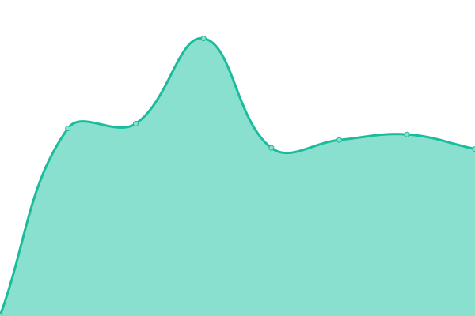
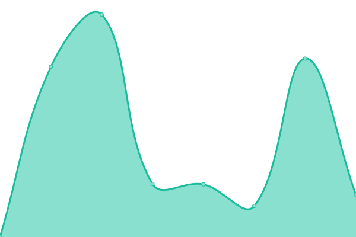
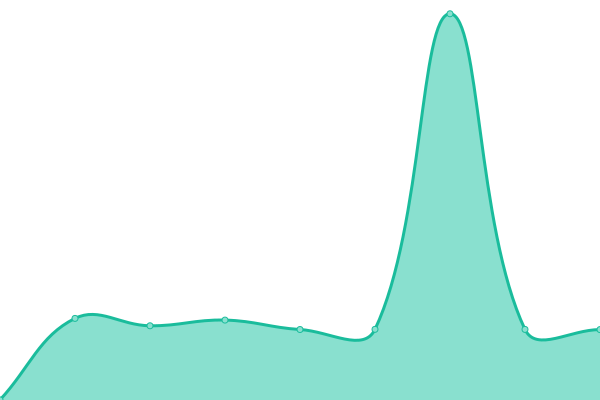
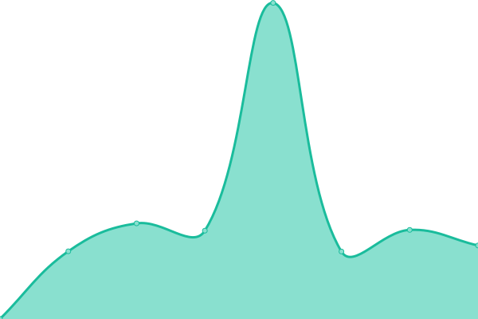
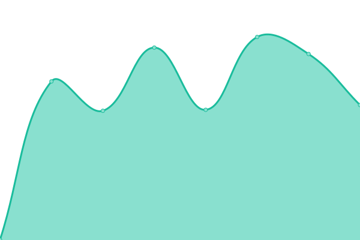
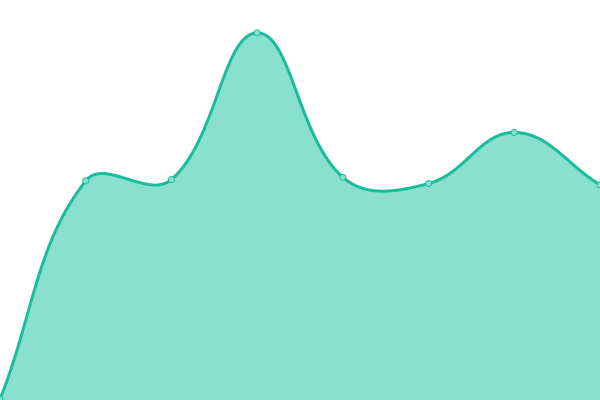
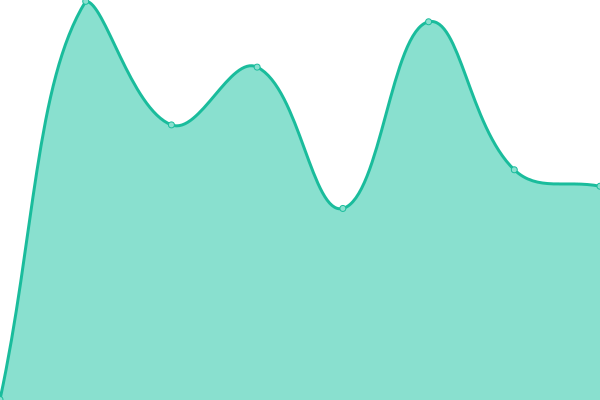
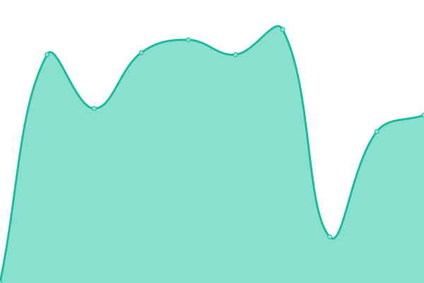
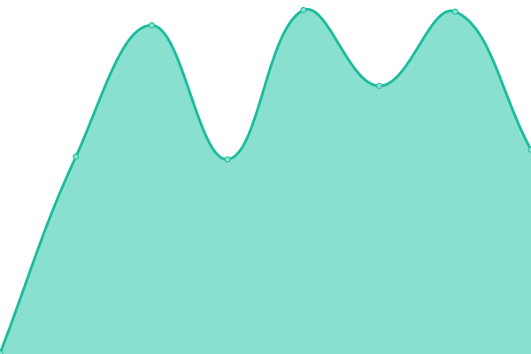

# [📈 Live Status](https://demo.upptime.js.org): <!--live status--> **🟧 Partial outage**

This repository contains the open-source uptime monitor and status page for [Upptime](https://upptime.js.org), powered by [Upptime](https://github.com/upptime/upptime).

With [Upptime](https://upptime.js.org), you can get your own unlimited and free uptime monitor and status page, powered entirely by a GitHub repository. We use [Issues](https://github.com/upptime/upptime/issues) as incident reports, [Actions](https://github.com/ishydo/nanhosting/monitoring/actions) as uptime monitors, and [Pages](https://demo.upptime.js.org) for the status page.

<!--start: status pages-->
<!-- This summary is generated by Upptime (https://github.com/upptime/upptime) -->
<!-- Do not edit this manually, your changes will be overwritten -->
<!-- prettier-ignore -->
| URL | Status | History | Response Time | Uptime |
| --- | ------ | ------- | ------------- | ------ |
|  [96gfn.ch](https://96gfn.ch) | 🟩 Up | [96gfn-ch.yml](https://github.com/nanhosting/monitoring/commits/HEAD/history/96gfn-ch.yml) | 

 4176ms
     
 | 

<a href="https://status.nanhosting.ch/history/96gfn-ch">99.54%</a>
    

|  [a-projectstudio.ch](https://a-projectstudio.ch) | 🟩 Up | [a-projectstudio-ch.yml](https://github.com/nanhosting/monitoring/commits/HEAD/history/a-projectstudio-ch.yml) | 

 948ms
     
 | 

<a href="https://status.nanhosting.ch/history/a-projectstudio-ch">99.54%</a>
    

|  [aaaaa.ooo](https://aaaaa.ooo) | 🟩 Up | [aaaaa-ooo.yml](https://github.com/nanhosting/monitoring/commits/HEAD/history/aaaaa-ooo.yml) | 

 1004ms
     
 | 

<a href="https://status.nanhosting.ch/history/aaaaa-ooo">99.55%</a>
    

|  [addrespect.ch](https://addrespect.ch) | 🟩 Up | [addrespect-ch.yml](https://github.com/nanhosting/monitoring/commits/HEAD/history/addrespect-ch.yml) | 

 1274ms
     
 | 

<a href="https://status.nanhosting.ch/history/addrespect-ch">99.55%</a>
    

|  [archaccompagnement.ch](https://archaccompagnement.ch) | 🟥 Down | [archaccompagnement-ch.yml](https://github.com/nanhosting/monitoring/commits/HEAD/history/archaccompagnement-ch.yml) | 

 0ms
     
 | 

<a href="https://status.nanhosting.ch/history/archaccompagnement-ch">0.00%</a>
    

|  [auxdelicesdelagare.ca](https://auxdelicesdelagare.ca) | 🟩 Up | [auxdelicesdelagare-ca.yml](https://github.com/nanhosting/monitoring/commits/HEAD/history/auxdelicesdelagare-ca.yml) | 

 1439ms
     
 | 

<a href="https://status.nanhosting.ch/history/auxdelicesdelagare-ca">99.56%</a>
    

|  [asfaddi.ch](https://asfaddi.ch) | 🟩 Up | [asfaddi-ch.yml](https://github.com/nanhosting/monitoring/commits/HEAD/history/asfaddi-ch.yml) | 

 671ms
     
 | 

<a href="https://status.nanhosting.ch/history/asfaddi-ch">99.56%</a>
    

|  [ballissima.ch](https://ballissima.ch) | 🟥 Down | [ballissima-ch.yml](https://github.com/nanhosting/monitoring/commits/HEAD/history/ballissima-ch.yml) | 

 0ms
     
 | 

<a href="https://status.nanhosting.ch/history/ballissima-ch">0.00%</a>
    

|  [beachtown.ch](https://beachtown.ch) | 🟩 Up | [beachtown-ch.yml](https://github.com/nanhosting/monitoring/commits/HEAD/history/beachtown-ch.yml) | 

 813ms
     
 | 

<a href="https://status.nanhosting.ch/history/beachtown-ch">99.57%</a>
    

|  [bookette.ch](https://bookette.ch) | 🟩 Up | [bookette-ch.yml](https://github.com/nanhosting/monitoring/commits/HEAD/history/bookette-ch.yml) | 

 1187ms
     
 | 

<a href="https://status.nanhosting.ch/history/bookette-ch">99.57%</a>
    

|  [bulle-detente.ch](https://bulle-detente.ch) | 🟩 Up | [bulle-detente-ch.yml](https://github.com/nanhosting/monitoring/commits/HEAD/history/bulle-detente-ch.yml) | 

 1446ms
     
 | 

<a href="https://status.nanhosting.ch/history/bulle-detente-ch">99.58%</a>
    

|  [but-first-relax.ch](https://but-first-relax.ch) | 🟩 Up | [but-first-relax-ch.yml](https://github.com/nanhosting/monitoring/commits/HEAD/history/but-first-relax-ch.yml) | 

 794ms
     
 | 

<a href="https://status.nanhosting.ch/history/but-first-relax-ch">99.58%</a>
    

|  [dariokurorusso.ch](https://dariokurorusso.ch) | 🟩 Up | [dariokurorusso-ch.yml](https://github.com/nanhosting/monitoring/commits/HEAD/history/dariokurorusso-ch.yml) | 

 746ms
     
 | 

<a href="https://status.nanhosting.ch/history/dariokurorusso-ch">99.59%</a>
    

|  [deterre.ch](https://deterre.ch) | 🟥 Down | [deterre-ch.yml](https://github.com/nanhosting/monitoring/commits/HEAD/history/deterre-ch.yml) | 

 0ms
     
 | 

<a href="https://status.nanhosting.ch/history/deterre-ch">0.00%</a>
    

|  [diotimagrossert.com](https://diotimagrossert.com) | 🟥 Down | [diotimagrossert-com.yml](https://github.com/nanhosting/monitoring/commits/HEAD/history/diotimagrossert-com.yml) | 

 530ms
     
 | 

<a href="https://status.nanhosting.ch/history/diotimagrossert-com">0.00%</a>
    

|  [do.min.icu](https://do.min.icu) | 🟩 Up | [do-min-icu.yml](https://github.com/nanhosting/monitoring/commits/HEAD/history/do-min-icu.yml) | 

 2514ms
     
 | 

<a href="https://status.nanhosting.ch/history/do-min-icu">99.60%</a>
    

|  [dominiqueantenen.ch](https://dominiqueantenen.ch) | 🟩 Up | [dominiqueantenen-ch.yml](https://github.com/nanhosting/monitoring/commits/HEAD/history/dominiqueantenen-ch.yml) | 

 1101ms
     
 | 

<a href="https://status.nanhosting.ch/history/dominiqueantenen-ch">99.60%</a>
    

|  [expandmarketing.ch](https://expandmarketing.ch) | 🟥 Down | [expandmarketing-ch.yml](https://github.com/nanhosting/monitoring/commits/HEAD/history/expandmarketing-ch.yml) | 

 0ms
     
 | 

<a href="https://status.nanhosting.ch/history/expandmarketing-ch">0.00%</a>
    

|  [fannygeiser.com](https://fannygeiser.com) | 🟩 Up | [fannygeiser-com.yml](https://github.com/nanhosting/monitoring/commits/HEAD/history/fannygeiser-com.yml) | 

 551ms
     
 | 

<a href="https://status.nanhosting.ch/history/fannygeiser-com">99.61%</a>
    

|  [feuillesetvie.ch](https://feuillesetvie.ch) | 🟩 Up | [feuillesetvie-ch.yml](https://github.com/nanhosting/monitoring/commits/HEAD/history/feuillesetvie-ch.yml) | 

 2625ms
     
 | 

<a href="https://status.nanhosting.ch/history/feuillesetvie-ch">99.61%</a>
    

|  [fsgfeminine-reconvilier.ch](https://fsgfeminine-reconvilier.ch) | 🟩 Up | [fsgfeminine-reconvilier-ch.yml](https://github.com/nanhosting/monitoring/commits/HEAD/history/fsgfeminine-reconvilier-ch.yml) | 

 690ms
     
 | 

<a href="https://status.nanhosting.ch/history/fsgfeminine-reconvilier-ch">99.62%</a>
    

|  [g-fid.ch](https://g-fid.ch) | 🟩 Up | [g-fid-ch.yml](https://github.com/nanhosting/monitoring/commits/HEAD/history/g-fid-ch.yml) | 

 772ms
     
 | 

<a href="https://status.nanhosting.ch/history/g-fid-ch">99.62%</a>
    

|  [impro-impact.ch](https://impro-impact.ch) | 🟩 Up | [impro-impact-ch.yml](https://github.com/nanhosting/monitoring/commits/HEAD/history/impro-impact-ch.yml) | 

 2993ms
     
 | 

<a href="https://status.nanhosting.ch/history/impro-impact-ch">99.63%</a>
    

|  [improcastel.ch](https://improcastel.ch) | 🟩 Up | [improcastel-ch.yml](https://github.com/nanhosting/monitoring/commits/HEAD/history/improcastel-ch.yml) | 

 856ms
     
 | 

<a href="https://status.nanhosting.ch/history/improcastel-ch">99.63%</a>
    

|  [joaouchoa.ch](https://joaouchoa.ch) | 🟩 Up | [joaouchoa-ch.yml](https://github.com/nanhosting/monitoring/commits/HEAD/history/joaouchoa-ch.yml) | 

 639ms
     
 | 

<a href="https://status.nanhosting.ch/history/joaouchoa-ch">99.63%</a>
    

|  [judoclubaubonne.ch](https://judoclubaubonne.ch) | 🟥 Down | [judoclubaubonne-ch.yml](https://github.com/nanhosting/monitoring/commits/HEAD/history/judoclubaubonne-ch.yml) | 

 0ms
     
 | 

<a href="https://status.nanhosting.ch/history/judoclubaubonne-ch">0.00%</a>
    

|  [judoclubcossonay.ch](https://judoclubcossonay.ch) | 🟩 Up | [judoclubcossonay-ch.yml](https://github.com/nanhosting/monitoring/commits/HEAD/history/judoclubcossonay-ch.yml) | 

 1171ms
     
 | 

<a href="https://status.nanhosting.ch/history/judoclubcossonay-ch">99.64%</a>
    

|  [judoclubstadelausanne.ch](https://judoclubstadelausanne.ch) | 🟩 Up | [judoclubstadelausanne-ch.yml](https://github.com/nanhosting/monitoring/commits/HEAD/history/judoclubstadelausanne-ch.yml) | 

 1153ms
     
 | 

<a href="https://status.nanhosting.ch/history/judoclubstadelausanne-ch">99.65%</a>
    

|  [julian-bader.ch](https://julian-bader.ch) | 🟩 Up | [julian-bader-ch.yml](https://github.com/nanhosting/monitoring/commits/HEAD/history/julian-bader-ch.yml) | 

 519ms
     
 | 

<a href="https://status.nanhosting.ch/history/julian-bader-ch">99.65%</a>
    

|  [kaje.ch](https://kaje.ch) | 🟩 Up | [kaje-ch.yml](https://github.com/nanhosting/monitoring/commits/HEAD/history/kaje-ch.yml) | 

 3172ms
     
 | 

<a href="https://status.nanhosting.ch/history/kaje-ch">99.66%</a>
    

|  [kin-ball-bienne.ch](https://kin-ball-bienne.ch) | 🟩 Up | [kin-ball-bienne-ch.yml](https://github.com/nanhosting/monitoring/commits/HEAD/history/kin-ball-bienne-ch.yml) | 

 2583ms
     
 | 

<a href="https://status.nanhosting.ch/history/kin-ball-bienne-ch">99.66%</a>
    

|  [koye.shop](https://koye.shop) | 🟩 Up | [koye-shop.yml](https://github.com/nanhosting/monitoring/commits/HEAD/history/koye-shop.yml) | 

 2956ms
     
 | 

<a href="https://status.nanhosting.ch/history/koye-shop">99.67%</a>
    

|  [learnitevent.ch](https://learnitevent.ch) | 🟥 Down | [learnitevent-ch.yml](https://github.com/nanhosting/monitoring/commits/HEAD/history/learnitevent-ch.yml) | 

 353ms
     
 | 

<a href="https://status.nanhosting.ch/history/learnitevent-ch">0.00%</a>
    

|  [marcbohren.com](https://marcbohren.com) | 🟩 Up | [marcbohren-com.yml](https://github.com/nanhosting/monitoring/commits/HEAD/history/marcbohren-com.yml) | 

 657ms
     
 | 

<a href="https://status.nanhosting.ch/history/marcbohren-com">99.67%</a>
    

|  [mcsprint.ch](https://mcsprint.ch) | 🟩 Up | [mcsprint-ch.yml](https://github.com/nanhosting/monitoring/commits/HEAD/history/mcsprint-ch.yml) | 

 1757ms
     
 | 

<a href="https://status.nanhosting.ch/history/mcsprint-ch">99.68%</a>
    

|  [mg24.ch](https://mg24.ch) | 🟩 Up | [mg24-ch.yml](https://github.com/nanhosting/monitoring/commits/HEAD/history/mg24-ch.yml) | 

 875ms
     
 | 

<a href="https://status.nanhosting.ch/history/mg24-ch">99.68%</a>
    

|  [mute-radio.ch](https://mute-radio.ch) | 🟩 Up | [mute-radio-ch.yml](https://github.com/nanhosting/monitoring/commits/HEAD/history/mute-radio-ch.yml) | 

 1897ms
     
 | 

<a href="https://status.nanhosting.ch/history/mute-radio-ch">99.69%</a>
    

|  [myrielleboillat.ch](https://myrielleboillat.ch) | 🟩 Up | [myrielleboillat-ch.yml](https://github.com/nanhosting/monitoring/commits/HEAD/history/myrielleboillat-ch.yml) | 

 739ms
     
 | 

<a href="https://status.nanhosting.ch/history/myrielleboillat-ch">99.69%</a>
    

|  [morphotonix.com](https://morphotonix.com) | 🟩 Up | [morphotonix-com.yml](https://github.com/nanhosting/monitoring/commits/HEAD/history/morphotonix-com.yml) | 

 923ms
     
 | 

<a href="https://status.nanhosting.ch/history/morphotonix-com">99.70%</a>
    

|  [nadiadedonno.ch](https://nadiadedonno.ch) | 🟩 Up | [nadiadedonno-ch.yml](https://github.com/nanhosting/monitoring/commits/HEAD/history/nadiadedonno-ch.yml) | 

 1538ms
     
 | 

<a href="https://status.nanhosting.ch/history/nadiadedonno-ch">99.70%</a>
    

|  [nanhosting.ch](https://nanhosting.ch) | 🟩 Up | [nanhosting-ch.yml](https://github.com/nanhosting/monitoring/commits/HEAD/history/nanhosting-ch.yml) | 

 4790ms
     
 | 

<a href="https://status.nanhosting.ch/history/nanhosting-ch">99.70%</a>
    

|  [nicowind.ch](https://nicowind.ch) | 🟩 Up | [nicowind-ch.yml](https://github.com/nanhosting/monitoring/commits/HEAD/history/nicowind-ch.yml) | 

 798ms
     
 | 

<a href="https://status.nanhosting.ch/history/nicowind-ch">99.71%</a>
    

|  [ninn.ch](https://ninn.ch) | 🟩 Up | [ninn-ch.yml](https://github.com/nanhosting/monitoring/commits/HEAD/history/ninn-ch.yml) | 

 673ms
     
 | 

<a href="https://status.nanhosting.ch/history/ninn-ch">99.71%</a>
    

|  [oddaya.ch](https://oddaya.ch) | 🟩 Up | [oddaya-ch.yml](https://github.com/nanhosting/monitoring/commits/HEAD/history/oddaya-ch.yml) | 

 545ms
     
 | 

<a href="https://status.nanhosting.ch/history/oddaya-ch">99.72%</a>
    

|  [osteo-jura.ch](https://osteo-jura.ch) | 🟩 Up | [osteo-jura-ch.yml](https://github.com/nanhosting/monitoring/commits/HEAD/history/osteo-jura-ch.yml) | 

 1062ms
     
 | 

<a href="https://status.nanhosting.ch/history/osteo-jura-ch">99.72%</a>
    

|  [osteoneuchatel.ch](https://osteoneuchatel.ch) | 🟩 Up | [osteoneuchatel-ch.yml](https://github.com/nanhosting/monitoring/commits/HEAD/history/osteoneuchatel-ch.yml) | 

 3394ms
     
 | 

<a href="https://status.nanhosting.ch/history/osteoneuchatel-ch">99.73%</a>
    

|  [osteosolothurn.ch](https://osteosolothurn.ch) | 🟩 Up | [osteosolothurn-ch.yml](https://github.com/nanhosting/monitoring/commits/HEAD/history/osteosolothurn-ch.yml) | 

 1399ms
     
 | 

<a href="https://status.nanhosting.ch/history/osteosolothurn-ch">99.73%</a>
    

|  [pixpakal.com](https://pixpakal.com) | 🟥 Down | [pixpakal-com.yml](https://github.com/nanhosting/monitoring/commits/HEAD/history/pixpakal-com.yml) | 

 0ms
     
 | 

<a href="https://status.nanhosting.ch/history/pixpakal-com">0.00%</a>
    

|  [polaris-psy.ch](https://polaris-psy.ch) | 🟥 Down | [polaris-psy-ch.yml](https://github.com/nanhosting/monitoring/commits/HEAD/history/polaris-psy-ch.yml) | 

 0ms
     
 | 

<a href="https://status.nanhosting.ch/history/polaris-psy-ch">0.00%</a>
    

|  [protokoll-studio.com](https://protokoll-studio.com) | 🟩 Up | [protokoll-studio-com.yml](https://github.com/nanhosting/monitoring/commits/HEAD/history/protokoll-studio-com.yml) | 

 645ms
     
 | 

<a href="https://status.nanhosting.ch/history/protokoll-studio-com">99.74%</a>
    

|  [quatre-mains.ch](https://quatre-mains.ch) | 🟩 Up | [quatre-mains-ch.yml](https://github.com/nanhosting/monitoring/commits/HEAD/history/quatre-mains-ch.yml) | 

 792ms
     
 | 

<a href="https://status.nanhosting.ch/history/quatre-mains-ch">99.74%</a>
    

|  [raitone.com](https://raitone.com) | 🟩 Up | [raitone-com.yml](https://github.com/nanhosting/monitoring/commits/HEAD/history/raitone-com.yml) | 

 1016ms
     
 | 

<a href="https://status.nanhosting.ch/history/raitone-com">99.75%</a>
    

|  [reboard.io](https://reboard.io) | 🟩 Up | [reboard-io.yml](https://github.com/nanhosting/monitoring/commits/HEAD/history/reboard-io.yml) | 

 891ms
     
 | 

<a href="https://status.nanhosting.ch/history/reboard-io">99.75%</a>
    

|  [ristoranteitalia-biel.ch](https://ristoranteitalia-biel.ch) | 🟩 Up | [ristoranteitalia-biel-ch.yml](https://github.com/nanhosting/monitoring/commits/HEAD/history/ristoranteitalia-biel-ch.yml) | 

 555ms
     
 | 

<a href="https://status.nanhosting.ch/history/ristoranteitalia-biel-ch">99.76%</a>
    

|  [road-crew.ch](https://road-crew.ch) | 🟥 Down | [road-crew-ch.yml](https://github.com/nanhosting/monitoring/commits/HEAD/history/road-crew-ch.yml) | 

 0ms
     
 | 

<a href="https://status.nanhosting.ch/history/road-crew-ch">0.00%</a>
    

|  [rockette.space](https://rockette.space) | 🟩 Up | [rockette-space.yml](https://github.com/nanhosting/monitoring/commits/HEAD/history/rockette-space.yml) | 

 513ms
     
 | 

<a href="https://status.nanhosting.ch/history/rockette-space">99.77%</a>
    

|  [rosafinta.com](https://rosafinta.com) | 🟩 Up | [rosafinta-com.yml](https://github.com/nanhosting/monitoring/commits/HEAD/history/rosafinta-com.yml) | 

 547ms
     
 | 

<a href="https://status.nanhosting.ch/history/rosafinta-com">99.77%</a>
    

|  [sollberger-ag.ch](https://sollberger-ag.ch) | 🟩 Up | [sollberger-ag-ch.yml](https://github.com/nanhosting/monitoring/commits/HEAD/history/sollberger-ag-ch.yml) | 

 429ms
     
 | 

<a href="https://status.nanhosting.ch/history/sollberger-ag-ch">99.78%</a>
    

|  [somewhere.photo](https://somewhere.photo) | 🟥 Down | [somewhere-photo.yml](https://github.com/nanhosting/monitoring/commits/HEAD/history/somewhere-photo.yml) | 

 0ms
     
 | 

<a href="https://status.nanhosting.ch/history/somewhere-photo">0.00%</a>
    

|  [soutienparental.ch](https://soutienparental.ch) | 🟩 Up | [soutienparental-ch.yml](https://github.com/nanhosting/monitoring/commits/HEAD/history/soutienparental-ch.yml) | 

 1991ms
     
 | 

<a href="https://status.nanhosting.ch/history/soutienparental-ch">99.78%</a>
    

|  [spoort.ch](https://spoort.ch) | 🟩 Up | [spoort-ch.yml](https://github.com/nanhosting/monitoring/commits/HEAD/history/spoort-ch.yml) | 

 520ms
     
 | 

<a href="https://status.nanhosting.ch/history/spoort-ch">99.79%</a>
    

|  [stitchbienne.ch](https://stitchbienne.ch) | 🟩 Up | [stitchbienne-ch.yml](https://github.com/nanhosting/monitoring/commits/HEAD/history/stitchbienne-ch.yml) | 

 583ms
     
 | 

<a href="https://status.nanhosting.ch/history/stitchbienne-ch">99.79%</a>
    

|  [sunset-massages.ch](https://sunset-massages.ch) | 🟥 Down | [sunset-massages-ch.yml](https://github.com/nanhosting/monitoring/commits/HEAD/history/sunset-massages-ch.yml) | 

 0ms
     
 | 

<a href="https://status.nanhosting.ch/history/sunset-massages-ch">0.00%</a>
    

|  [travelerandco.ch](https://travelerandco.ch) | 🟩 Up | [travelerandco-ch.yml](https://github.com/nanhosting/monitoring/commits/HEAD/history/travelerandco-ch.yml) | 

 2358ms
     
 | 

<a href="https://status.nanhosting.ch/history/travelerandco-ch">99.79%</a>
    

|  [twentys.ch](https://twentys.ch) | 🟩 Up | [twentys-ch.yml](https://github.com/nanhosting/monitoring/commits/HEAD/history/twentys-ch.yml) | 

 613ms
     
 | 

<a href="https://status.nanhosting.ch/history/twentys-ch">99.80%</a>
    

|  [valaela.com](https://valaela.com) | 🟩 Up | [valaela-com.yml](https://github.com/nanhosting/monitoring/commits/HEAD/history/valaela-com.yml) | 

 2409ms
     
 | 

<a href="https://status.nanhosting.ch/history/valaela-com">99.80%</a>
    

|  [valerio-personeni.com](https://valerio-personeni.com) | 🟩 Up | [valerio-personeni-com.yml](https://github.com/nanhosting/monitoring/commits/HEAD/history/valerio-personeni-com.yml) | 

 642ms
     
 | 

<a href="https://status.nanhosting.ch/history/valerio-personeni-com">99.81%</a>
    

|  [vngl.ooo](https://vngl.ooo) | 🟩 Up | [vngl-ooo.yml](https://github.com/nanhosting/monitoring/commits/HEAD/history/vngl-ooo.yml) | 

 737ms
     
 | 

<a href="https://status.nanhosting.ch/history/vngl-ooo">99.81%</a>
    

|  [watermarkme.io](https://watermarkme.io) | 🟥 Down | [watermarkme-io.yml](https://github.com/nanhosting/monitoring/commits/HEAD/history/watermarkme-io.yml) | 

 0ms
     
 | 

<a href="https://status.nanhosting.ch/history/watermarkme-io">0.00%</a>
    

|  [yoma-design.ch](https://yoma-design.ch) | 🟩 Up | [yoma-design-ch.yml](https://github.com/nanhosting/monitoring/commits/HEAD/history/yoma-design-ch.yml) | 

 1547ms
     
 | 

<a href="https://status.nanhosting.ch/history/yoma-design-ch">99.82%</a>
    

<!--end: status pages-->

[**Visit our status website →**](https://demo.upptime.js.org)

## 📄 License

- Powered by: [Upptime](https://github.com/upptime/upptime)
- Code: [MIT](./LICENSE) © [Upptime](https://upptime.js.org)
- Data in the `./history` directory: [Open Database License](https://opendatacommons.org/licenses/odbl/1-0/)
