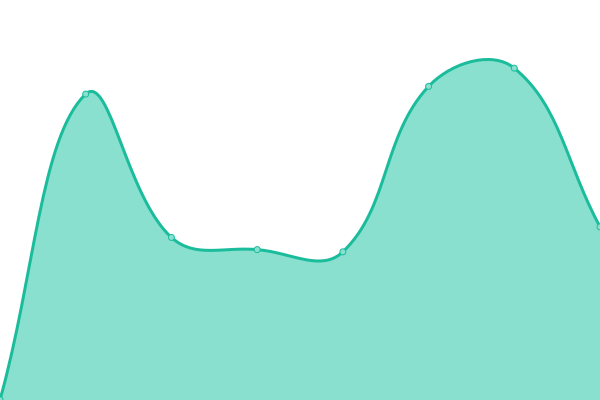

# [📈 Live Status](https://demo.upptime.js.org): <!--live status--> **🟧 Partial outage**

This repository contains the open-source uptime monitor and status page for [Upptime](https://upptime.js.org), powered by [Upptime](https://github.com/upptime/upptime).

With [Upptime](https://upptime.js.org), you can get your own unlimited and free uptime monitor and status page, powered entirely by a GitHub repository. We use [Issues](https://github.com/upptime/upptime/issues) as incident reports, [Actions](https://github.com/ishydo/nanhosting/monitoring/actions) as uptime monitors, and [Pages](https://demo.upptime.js.org) for the status page.

<!--start: status pages-->
<!-- This summary is generated by Upptime (https://github.com/upptime/upptime) -->
<!-- Do not edit this manually, your changes will be overwritten -->
<!-- prettier-ignore -->
| URL | Status | History | Response Time | Uptime |
| --- | ------ | ------- | ------------- | ------ |
|  [96gfn.ch](https://96gfn.ch) | 🟩 Up | [96gfn-ch.yml](https://github.com/nanhosting/monitoring/commits/HEAD/history/96gfn-ch.yml) | 

 2693ms
     
 | 

<a href="https://status.nanhosting.ch/history/96gfn-ch">100.00%</a>
    

|  [a-projectstudio.ch](https://a-projectstudio.ch) | 🟩 Up | [a-projectstudio-ch.yml](https://github.com/nanhosting/monitoring/commits/HEAD/history/a-projectstudio-ch.yml) | 

 825ms
     
 | 

<a href="https://status.nanhosting.ch/history/a-projectstudio-ch">100.00%</a>
    

|  [assafi.org](https://assafi.org) | 🟩 Up | [assafi-org.yml](https://github.com/nanhosting/monitoring/commits/HEAD/history/assafi-org.yml) | 

 820ms
     
 | 

<a href="https://status.nanhosting.ch/history/assafi-org">99.71%</a>
    

|  [auxdelicesdelagare.ca](https://auxdelicesdelagare.ca) | 🟩 Up | [auxdelicesdelagare-ca.yml](https://github.com/nanhosting/monitoring/commits/HEAD/history/auxdelicesdelagare-ca.yml) | 

 1888ms
     
 | 

<a href="https://status.nanhosting.ch/history/auxdelicesdelagare-ca">100.00%</a>
    

|  [ballissima.ch](https://ballissima.ch) | 🟩 Up | [ballissima-ch.yml](https://github.com/nanhosting/monitoring/commits/HEAD/history/ballissima-ch.yml) | 

 749ms
     
 | 

<a href="https://status.nanhosting.ch/history/ballissima-ch">100.00%</a>
    

|  [beachtown.ch](https://beachtown.ch) | 🟩 Up | [beachtown-ch.yml](https://github.com/nanhosting/monitoring/commits/HEAD/history/beachtown-ch.yml) | 

 908ms
     
 | 

<a href="https://status.nanhosting.ch/history/beachtown-ch">100.00%</a>
    

|  [bulle-detente.ch](https://bulle-detente.ch) | 🟩 Up | [bulle-detente-ch.yml](https://github.com/nanhosting/monitoring/commits/HEAD/history/bulle-detente-ch.yml) | 

 1393ms
     
 | 

<a href="https://status.nanhosting.ch/history/bulle-detente-ch">100.00%</a>
    

|  [but-first-relax.ch](https://but-first-relax.ch) | 🟩 Up | [but-first-relax-ch.yml](https://github.com/nanhosting/monitoring/commits/HEAD/history/but-first-relax-ch.yml) | 

 1531ms
     
 | 

<a href="https://status.nanhosting.ch/history/but-first-relax-ch">100.00%</a>
    

|  [diotimagrossert.com](https://diotimagrossert.com) | 🟩 Up | [diotimagrossert-com.yml](https://github.com/nanhosting/monitoring/commits/HEAD/history/diotimagrossert-com.yml) | 

 842ms
     
 | 

<a href="https://status.nanhosting.ch/history/diotimagrossert-com">100.00%</a>
    

|  [do.min.icu](https://do.min.icu) | 🟩 Up | [do-min-icu.yml](https://github.com/nanhosting/monitoring/commits/HEAD/history/do-min-icu.yml) | 

 834ms
     
 | 

<a href="https://status.nanhosting.ch/history/do-min-icu">100.00%</a>
    

|  [dominiqueantenen.ch](https://dominiqueantenen.ch) | 🟩 Up | [dominiqueantenen-ch.yml](https://github.com/nanhosting/monitoring/commits/HEAD/history/dominiqueantenen-ch.yml) | 

 1069ms
     
 | 

<a href="https://status.nanhosting.ch/history/dominiqueantenen-ch">100.00%</a>
    

|  [expandmarketing.ch](https://expandmarketing.ch) | 🟩 Up | [expandmarketing-ch.yml](https://github.com/nanhosting/monitoring/commits/HEAD/history/expandmarketing-ch.yml) | 

 2393ms
     
 | 

<a href="https://status.nanhosting.ch/history/expandmarketing-ch">100.00%</a>
    

|  [faki-ongd.ch](https://faki-ongd.ch) | 🟥 Down | [faki-ongd-ch.yml](https://github.com/nanhosting/monitoring/commits/HEAD/history/faki-ongd-ch.yml) | 

 0ms
     
 | 

<a href="https://status.nanhosting.ch/history/faki-ongd-ch">0.00%</a>
    

|  [hoomau.ch](https://hoomau.ch) | 🟩 Up | [hoomau-ch.yml](https://github.com/nanhosting/monitoring/commits/HEAD/history/hoomau-ch.yml) | 

 963ms
     
 | 

<a href="https://status.nanhosting.ch/history/hoomau-ch">100.00%</a>
    

|  [impro-impact.ch](https://impro-impact.ch) | 🟩 Up | [impro-impact-ch.yml](https://github.com/nanhosting/monitoring/commits/HEAD/history/impro-impact-ch.yml) | 

 783ms
     
 | 

<a href="https://status.nanhosting.ch/history/impro-impact-ch">100.00%</a>
    

|  [improcastel.ch](https://improcastel.ch) | 🟥 Down | [improcastel-ch.yml](https://github.com/nanhosting/monitoring/commits/HEAD/history/improcastel-ch.yml) | 

 1101ms
     
 | 

<a href="https://status.nanhosting.ch/history/improcastel-ch">0.00%</a>
    

|  [if8.io](https://if8.io) | 🟩 Up | [if8-io.yml](https://github.com/nanhosting/monitoring/commits/HEAD/history/if8-io.yml) | 

 542ms
     
 | 

<a href="https://status.nanhosting.ch/history/if8-io">100.00%</a>
    

|  [joaouchoa.ch](https://joaouchoa.ch) | 🟩 Up | [joaouchoa-ch.yml](https://github.com/nanhosting/monitoring/commits/HEAD/history/joaouchoa-ch.yml) | 

 612ms
     
 | 

<a href="https://status.nanhosting.ch/history/joaouchoa-ch">100.00%</a>
    

|  [judoclubaubonne.ch](https://judoclubaubonne.ch) | 🟩 Up | [judoclubaubonne-ch.yml](https://github.com/nanhosting/monitoring/commits/HEAD/history/judoclubaubonne-ch.yml) | 

 1903ms
     
 | 

<a href="https://status.nanhosting.ch/history/judoclubaubonne-ch">100.00%</a>
    

|  [judoclubcossonay.ch](https://judoclubcossonay.ch) | 🟩 Up | [judoclubcossonay-ch.yml](https://github.com/nanhosting/monitoring/commits/HEAD/history/judoclubcossonay-ch.yml) | 

 1635ms
     
 | 

<a href="https://status.nanhosting.ch/history/judoclubcossonay-ch">100.00%</a>
    

|  [judoclubstadelausanne.ch](https://judoclubstadelausanne.ch) | 🟩 Up | [judoclubstadelausanne-ch.yml](https://github.com/nanhosting/monitoring/commits/HEAD/history/judoclubstadelausanne-ch.yml) | 

 1593ms
     
 | 

<a href="https://status.nanhosting.ch/history/judoclubstadelausanne-ch">100.00%</a>
    

|  [julian-bader.ch](https://julian-bader.ch) | 🟩 Up | [julian-bader-ch.yml](https://github.com/nanhosting/monitoring/commits/HEAD/history/julian-bader-ch.yml) | 

 544ms
     
 | 

<a href="https://status.nanhosting.ch/history/julian-bader-ch">100.00%</a>
    

|  [kaje.ch](https://kaje.ch) | 🟩 Up | [kaje-ch.yml](https://github.com/nanhosting/monitoring/commits/HEAD/history/kaje-ch.yml) | 

 1084ms
     
 | 

<a href="https://status.nanhosting.ch/history/kaje-ch">100.00%</a>
    

|  [learnitevent.ch](https://learnitevent.ch) | 🟩 Up | [learnitevent-ch.yml](https://github.com/nanhosting/monitoring/commits/HEAD/history/learnitevent-ch.yml) | 

 1625ms
     
 | 

<a href="https://status.nanhosting.ch/history/learnitevent-ch">100.00%</a>
    

|  [maccatattoo.ch](https://maccatattoo.ch) | 🟩 Up | [maccatattoo-ch.yml](https://github.com/nanhosting/monitoring/commits/HEAD/history/maccatattoo-ch.yml) | 

 785ms
     
 | 

<a href="https://status.nanhosting.ch/history/maccatattoo-ch">100.00%</a>
    

|  [marcbohren.com](https://marcbohren.com) | 🟩 Up | [marcbohren-com.yml](https://github.com/nanhosting/monitoring/commits/HEAD/history/marcbohren-com.yml) | 

 1934ms
     
 | 

<a href="https://status.nanhosting.ch/history/marcbohren-com">100.00%</a>
    

|  [mcsprint.ch](https://mcsprint.ch) | 🟩 Up | [mcsprint-ch.yml](https://github.com/nanhosting/monitoring/commits/HEAD/history/mcsprint-ch.yml) | 

 1436ms
     
 | 

<a href="https://status.nanhosting.ch/history/mcsprint-ch">100.00%</a>
    

|  [mg24.ch](https://mg24.ch) | 🟩 Up | [mg24-ch.yml](https://github.com/nanhosting/monitoring/commits/HEAD/history/mg24-ch.yml) | 

 754ms
     
 | 

<a href="https://status.nanhosting.ch/history/mg24-ch">100.00%</a>
    

|  [morphotonix.com](https://morphotonix.com) | 🟩 Up | [morphotonix-com.yml](https://github.com/nanhosting/monitoring/commits/HEAD/history/morphotonix-com.yml) | 

 982ms
     
 | 

<a href="https://status.nanhosting.ch/history/morphotonix-com">100.00%</a>
    

|  [nadiadedonno.ch](https://nadiadedonno.ch) | 🟩 Up | [nadiadedonno-ch.yml](https://github.com/nanhosting/monitoring/commits/HEAD/history/nadiadedonno-ch.yml) | 

 1583ms
     
 | 

<a href="https://status.nanhosting.ch/history/nadiadedonno-ch">100.00%</a>
    

|  [nanhosting.ch](https://nanhosting.ch) | 🟩 Up | [nanhosting-ch.yml](https://github.com/nanhosting/monitoring/commits/HEAD/history/nanhosting-ch.yml) | 

 3080ms
     
 | 

<a href="https://status.nanhosting.ch/history/nanhosting-ch">100.00%</a>
    

|  [nanosite.ch](https://nanosite.ch) | 🟩 Up | [nanosite-ch.yml](https://github.com/nanhosting/monitoring/commits/HEAD/history/nanosite-ch.yml) | 

 809ms
     
 | 

<a href="https://status.nanhosting.ch/history/nanosite-ch">100.00%</a>
    

|  [nicowind.ch](https://nicowind.ch) | 🟩 Up | [nicowind-ch.yml](https://github.com/nanhosting/monitoring/commits/HEAD/history/nicowind-ch.yml) | 

 787ms
     
 | 

<a href="https://status.nanhosting.ch/history/nicowind-ch">100.00%</a>
    

|  [ninn.ch](https://ninn.ch) | 🟩 Up | [ninn-ch.yml](https://github.com/nanhosting/monitoring/commits/HEAD/history/ninn-ch.yml) | 

 662ms
     
 | 

<a href="https://status.nanhosting.ch/history/ninn-ch">100.00%</a>
    

|  [osteoneuchatel.ch](https://osteoneuchatel.ch) | 🟩 Up | [osteoneuchatel-ch.yml](https://github.com/nanhosting/monitoring/commits/HEAD/history/osteoneuchatel-ch.yml) | 

 507ms
     
 | 

<a href="https://status.nanhosting.ch/history/osteoneuchatel-ch">100.00%</a>
    

|  [osteosolothurn.ch](https://osteosolothurn.ch) | 🟩 Up | [osteosolothurn-ch.yml](https://github.com/nanhosting/monitoring/commits/HEAD/history/osteosolothurn-ch.yml) | 

 499ms
     
 | 

<a href="https://status.nanhosting.ch/history/osteosolothurn-ch">100.00%</a>
    

|  [pixpakal.com](https://pixpakal.com) | 🟩 Up | [pixpakal-com.yml](https://github.com/nanhosting/monitoring/commits/HEAD/history/pixpakal-com.yml) | 

 1928ms
     
 | 

<a href="https://status.nanhosting.ch/history/pixpakal-com">100.00%</a>
    

|  [protokoll-studio.com](https://protokoll-studio.com) | 🟩 Up | [protokoll-studio-com.yml](https://github.com/nanhosting/monitoring/commits/HEAD/history/protokoll-studio-com.yml) | 

 606ms
     
 | 

<a href="https://status.nanhosting.ch/history/protokoll-studio-com">100.00%</a>
    

|  [raitone.com](https://raitone.com) | 🟩 Up | [raitone-com.yml](https://github.com/nanhosting/monitoring/commits/HEAD/history/raitone-com.yml) | 

 848ms
     
 | 

<a href="https://status.nanhosting.ch/history/raitone-com">100.00%</a>
    

|  [reboard.io](https://reboard.io) | 🟩 Up | [reboard-io.yml](https://github.com/nanhosting/monitoring/commits/HEAD/history/reboard-io.yml) | 

 703ms
     
 | 

<a href="https://status.nanhosting.ch/history/reboard-io">100.00%</a>
    

|  [snapwin.it](https://snapwin.it) | 🟩 Up | [snapwin-it.yml](https://github.com/nanhosting/monitoring/commits/HEAD/history/snapwin-it.yml) | 

 853ms
     
 | 

<a href="https://status.nanhosting.ch/history/snapwin-it">100.00%</a>
    

|  [somewhere.photo](https://somewhere.photo) | 🟩 Up | [somewhere-photo.yml](https://github.com/nanhosting/monitoring/commits/HEAD/history/somewhere-photo.yml) | 

 1791ms
     
 | 

<a href="https://status.nanhosting.ch/history/somewhere-photo">100.00%</a>
    

|  [sunset-massages.ch](https://sunset-massages.ch) | 🟩 Up | [sunset-massages-ch.yml](https://github.com/nanhosting/monitoring/commits/HEAD/history/sunset-massages-ch.yml) | 

 1028ms
     
 | 

<a href="https://status.nanhosting.ch/history/sunset-massages-ch">100.00%</a>
    

|  [travelerandco.ch](https://travelerandco.ch) | 🟩 Up | [travelerandco-ch.yml](https://github.com/nanhosting/monitoring/commits/HEAD/history/travelerandco-ch.yml) | 

 2535ms
     
 | 

<a href="https://status.nanhosting.ch/history/travelerandco-ch">100.00%</a>
    

|  [valerio-personeni.com](https://valerio-personeni.com) | 🟩 Up | [valerio-personeni-com.yml](https://github.com/nanhosting/monitoring/commits/HEAD/history/valerio-personeni-com.yml) | 

 598ms
     
 | 

<a href="https://status.nanhosting.ch/history/valerio-personeni-com">100.00%</a>
    

|  [vngl.ooo](https://vngl.ooo) | 🟩 Up | [vngl-ooo.yml](https://github.com/nanhosting/monitoring/commits/HEAD/history/vngl-ooo.yml) | 

 592ms
     
 | 

<a href="https://status.nanhosting.ch/history/vngl-ooo">100.00%</a>
    

|  [watermarkme.io](https://watermarkme.io) | 🟩 Up | [watermarkme-io.yml](https://github.com/nanhosting/monitoring/commits/HEAD/history/watermarkme-io.yml) | 

 466ms
     
 | 

<a href="https://status.nanhosting.ch/history/watermarkme-io">100.00%</a>
    

|  [yoma-design.ch](https://yoma-design.ch) | 🟩 Up | [yoma-design-ch.yml](https://github.com/nanhosting/monitoring/commits/HEAD/history/yoma-design-ch.yml) | 

 1448ms
     
 | 

<a href="https://status.nanhosting.ch/history/yoma-design-ch">100.00%</a>
    

<!--end: status pages-->

[**Visit our status website →**](https://demo.upptime.js.org)

## 📄 License

- Powered by: [Upptime](https://github.com/upptime/upptime)
- Code: [MIT](./LICENSE) © [Upptime](https://upptime.js.org)
- Data in the `./history` directory: [Open Database License](https://opendatacommons.org/licenses/odbl/1-0/)
